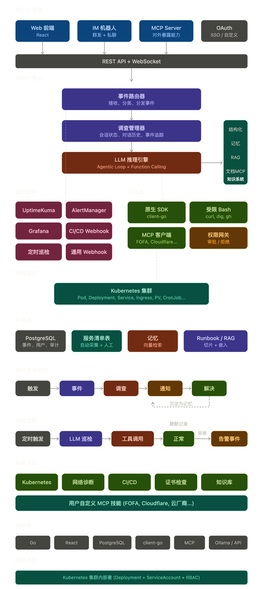

# Orca

# Orca - AI-Powered Operations Agent

> 事件驱动的智能运维 Agent，为 Kubernetes 集群提供 7×24 自动值守、AI 排障和团队协作能力。

---

## 项目定位

Orca 是一个开源的运维 Agent 平台，核心解决三个问题：

1. **异常发现**：通过插件化告警源接入 + 自动巡检，第一时间感知环境异常
2. **智能排障**：LLM 驱动的 Agentic Loop，自主调用工具链进行根因分析
3. **团队协作**：事件追踪、模块分工、群通知、知识积累，让运维经验沉淀为团队资产

目标用户：独立开发者、小型运维团队（3-50 人）、实验室/工作站运维场景。

---

## 系统架构总览


---

## 核心模块设计

### 1. 事件系统 (Event System)

事件是 Orca 的基本工作单元。每个异常信号或用户请求都抽象为一个 Event，Event 触发后创建一个 Investigation（调查会话），用户可围绕该会话持续对话追踪。

#### 数据模型

```
Event
├── id              唯一标识
├── source          来源（"uptime-kuma" | "grafana" | "patrol:cluster-health" | "user"）
├── severity        严重程度（"critical" | "warning" | "info"）
├── title           事件标题
├── payload         原始数据（各插件自定义 JSON）
├── related_services 关联服务（用于匹配模块负责人）
└── created_at

Investigation
├── id
├── event_id        关联事件
├── user_id         当前跟进人
├── status          状态（"open" | "investigating" | "resolved" | "stale"）
├── messages[]      完整对话记录（用户 + Agent）
├── actions[]       Agent 执行过的操作（审计日志）
├── summary         LLM 生成的调查摘要
├── created_at
└── resolved_at

Message
├── id
├── investigation_id
├── user_id         发送者（用户 ID 或 "agent"）
├── role            "user" | "assistant" | "system"
├── content
└── created_at
```

#### 事件生命周期

```
触发源产生信号
    │
    ▼
Trigger Plugin 解析 → 生成 Event
    │
    ▼
Event Router 接收
    ├── 匹配关联服务 → 确定模块负责人
    ├── 创建 Investigation（status = open）
    ├── 通知：IM 群发 + @ 负责人
    └── 通知：Web 前端实时推送
    │
    ▼
Agent 自动开始排查（status = investigating）
    ├── LLM Engine 启动 Agentic Loop
    ├── 调用工具收集信息
    ├── 检索知识库 + 记忆
    ├── 生成根因分析 + 修复建议
    └── 发送到 IM 群 + Web 前端
    │
    ▼
用户介入（可选）
    ├── 回复消息追问 → 继续对话
    ├── 确认执行修复 → Agent 执行操作
    └── 手动标记已解决
    │
    ▼
Investigation resolved
    ├── LLM 总结本次事件：症状 → 根因 → 解法
    ├── 写入记忆（团队共享）
    └── 记录到巡检日志
```

---

### 2. 触发插件系统 (Trigger Plugin System)

插件化设计，每个告警源实现统一接口，支持热插拔。

#### 插件接口

```go
type TriggerPlugin interface {
    Name() string
    Start(ctx context.Context, eventCh chan<- Event) error
    Stop() error
    HealthCheck() error
}
```

#### 计划支持的插件

| 插件 | 触发方式 | 优先级 | 说明 |
|---|---|---|---|
| `uptime-kuma` | Webhook | P0 (MVP) | 网站/服务可用性监控 |
| `alertmanager` | Webhook | P0 (MVP) | Prometheus 告警 |
| `grafana` | Webhook | P1 | Grafana Alerting |
| `cicd-webhook` | Webhook | P1 | CI/CD 构建失败触发 |
| `user-request` | IM / Web | P0 (MVP) | 用户主动提问或下命令 |
| `patrol` | 内置定时 | P0 (MVP) | 自动巡检 |
| `webhook-generic` | Webhook | P2 | 通用 Webhook，用户自定义解析 |

#### Webhook 统一入口

```
POST /api/webhooks/uptime-kuma
POST /api/webhooks/alertmanager
POST /api/webhooks/grafana
POST /api/webhooks/cicd
POST /api/webhooks/generic
```

每个端点带 secret token 验证。

---

### 3. 自动巡检系统 (Patrol System)

不写规则，写 prompt——LLM 根据自然语言指令自主决定检查什么、怎么判断。

#### 巡检配置示例

```yaml
patrols:
  - name: cluster-health
    schedule: "*/15 * * * *"
    prompt: |
      巡检 Kubernetes 集群健康状况：
      1. 检查所有 namespace 的 Pod 状态
      2. 检查最近 15 分钟的 Warning 事件
      3. 检查 Node 资源使用率
    severity_threshold: warning

  - name: cert-check
    schedule: "0 9 * * *"
    prompt: |
      检查所有 TLS Secret 证书过期时间。
      30 天内过期标记 warning，7 天内标记 critical。
    severity_threshold: warning

  - name: storage-check
    schedule: "0 */6 * * *"
    prompt: |
      检查所有 PVC 使用率。超过 80% warning，超过 90% critical。
    severity_threshold: warning
```

#### 巡检执行流程

```
Cron 触发
    │
    ▼
LLM 自主执行 Agentic Loop
    ├── 调用 get_pods / get_events / get_node_status / ...
    ├── 分析结果，按需追加调用
    └── 输出结构化报告
    │
    ├── healthy → 静默，记录日志
    ├── warning → 生成 Event（普通通知）
    └── critical → 生成 Event（@ 负责人 + 深度调查）
```

---

### 4. LLM 推理引擎 (LLM Engine)

```
System Prompt + 结构化上下文 + 记忆 top3 + RAG 段落 + 对话历史 + 工具列表
    │
    ▼
LLM 推理（多轮 Function Calling 迭代）
    │
    ▼
分析结论 + 建议 + 可选操作
```

Provider 支持：Ollama / OpenAI / Anthropic / DeepSeek / 任何 OpenAI-compatible 端点。

---

### 5. 工具层 (Tool Layer)

#### 原生 SDK（client-go）

| 工具 | 权限 |
|---|---|
| `get_pods` / `get_pod_logs` / `describe_resource` | 只读 |
| `get_events` / `get_node_status` / `get_pvcs` | 只读 |
| `get_ingresses` / `get_secrets_metadata` | 只读 |
| `rollout_restart` / `scale_deployment` / `delete_pod` | 写（需确认） |

#### 受限 Bash（白名单）

允许：`curl -I` / `dig` / `ping -c` / `traceroute` / `gh run list` / `df -h`
禁止：`rm` / `dd` / `kubectl delete` / `sudo` / `| sh`
约束：30s 超时，10KB 输出截断，全部审计。

#### MCP 客户端（外部扩展）

FOFA / Cloudflare / Grafana / 云厂商 / 文档源，用户在 Web 前端配置。

---

### 6. 知识系统 (Knowledge System)

| 层 | 数据类型 | 写入方式 | 读取方式 | 存储 |
|---|---|---|---|---|
| 结构化上下文 | 服务拓扑/元信息 | 自动采集 + 手动编辑 | 精确查询 | PG services 表 |
| 记忆 | 历史事件的症状→根因→解法 | Investigation resolved 时自动总结 | pgvector 相似度检索 | PG knowledge 表 |
| RAG 文档 | Runbook/排障手册 | Web 前端上传 Markdown | pgvector 相似度检索 | PG knowledge 表 |
| 外部文档 | Confluence/Notion 等 | 用户配 MCP 连接 | LLM 按需调 MCP | 不存本地 |

---

### 7. 用户系统 (User System)

单租户多用户：一个 Orca 实例管一套集群，多人按模块分工。

```sql
CREATE TABLE users (
    id              TEXT PRIMARY KEY,
    name            TEXT NOT NULL,
    avatar          TEXT,
    provider        TEXT,
    provider_id     TEXT,
    role            TEXT DEFAULT 'member',
    modules         JSONB,
    im_id           TEXT,
    created_at      TIMESTAMPTZ
);
```

认证：OAuth 2.0 / OIDC，支持自定义 SSO 后端。

权限：admin 可执行所有操作，member 对自己负责的模块可执行低风险写操作，高风险写操作需 admin 确认。

---

### 8. 交互层

#### Web 前端 (React)

Dashboard / Events / Investigation / Chat / Knowledge / Patrol / Settings

实时更新：WebSocket 推送 + Agent 推理流式输出。

#### IM 机器人

群发事件通知 + @ 负责人，reply 自动关联 Investigation。支持 `/ask` / `/approve` / `/status` 等命令。私聊模式可独立对话。

通知策略：critical 群通知 + @ + 私聊值班人，warning 仅群通知，info 静默。

#### MCP Server

暴露 `cluster_query` / `cluster_logs` / `investigation_list` / `knowledge_search` / `cluster_execute` / `patrol_status` 等 Tools，与 Web 共用认证。

---

### 9. 技能系统 (Skill System)

内置 Skills：Kubernetes / 网络诊断 / CI/CD / 证书检查 / 知识库。

用户扩展：通过 MCP 接入，Web 前端配置连接即可。

---

## 数据存储

PostgreSQL + pgvector 扩展。

核心表：users / events / investigations / messages / actions / services / knowledge / patrol_logs / patrol_configs / plugin_configs / mcp_connections。

---

## 部署

Kubernetes 集群内部署（Deployment + ServiceAccount + RBAC），PostgreSQL 可集群内或外部托管。

---

## 技术栈

| 组件 | 选型 |
|---|---|
| 后端 | Go |
| 前端 | React |
| 数据库 | PostgreSQL + pgvector |
| K8s 交互 | client-go |
| LLM 接入 | OpenAI-compatible API |
| Embedding | all-MiniLM-L6-v2 (ONNX) |
| IM Bot | 平台 SDK（按需接入） |
| MCP | Go 实现 |
| 认证 | OAuth 2.0 / OIDC / 自定义 SSO |
| 实时通信 | WebSocket |

---

## 开发路线

### Phase 1 — MVP

- [ ] Agent Core：Event System + Investigation Manager
- [ ] LLM Engine：OpenAI-compatible + Function Calling + Agentic Loop
- [ ] Kubernetes Skill：基础 get/describe/logs
- [ ] Trigger：UptimeKuma Webhook + 用户请求
- [ ] Patrol：基础定时巡检
- [ ] Knowledge：结构化上下文（自动采集 + 手动编辑）
- [ ] IM Bot：群发通知 + 回复对话
- [ ] Web 前端：Dashboard + Events + Chat
- [ ] 认证：对接内部 SSO
- [ ] REST API + PostgreSQL 初始化

### Phase 2 — 扩展能力

- [ ] Trigger：AlertManager / Grafana / CI/CD Webhook
- [ ] Knowledge：记忆 + RAG + pgvector 检索
- [ ] 受限 Bash 工具
- [ ] MCP Server + MCP Client
- [ ] Web：Knowledge 管理 + Patrol 配置 + Settings
- [ ] 写操作权限 + 审批流

### Phase 3 — 团队协作

- [ ] 值班轮转排班
- [ ] 事件升级策略
- [ ] 事件交接 + LLM 自动摘要
- [ ] 自动 Postmortem
- [ ] 巡检 Dashboard

### Phase 4 — 高级特性

- [ ] 多集群支持
- [ ] Docker Compose 环境支持
- [ ] 自适应巡检频率
- [ ] 云厂商 MCP 接入
- [ ] Skill 市场 / 社区插件


